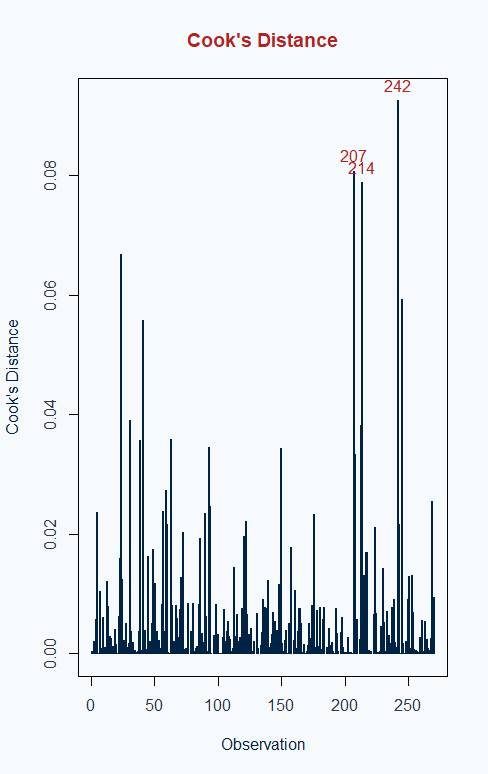

<div class="content">

<h1 class="title">Modeling the Impact of Salary Distribution on NHL Team Success</h1>

<p class="author-block">
  Sloane Holtby<br>
  McGill University<br>
  July 2025<br>
</p>


<h4>Abstract</h4>

<p class="abstract">
  While salary cap compliance is a central focus in professional sports roster management, the distribution of salaries within a team--how resources are allocated between stars, mid-tier players, and depth--has received comparatively little analytical attention as a driver of on-ice success. This study investigates how intra-team salary distribution impacts team performance over ten seasons in the National Hockey League (NHL), a league governed by a strict salary cap. Using the Gini coefficient and its squared term as explanatory variables, and Regulation + Overtime Wins (ROW) as the performance metric, I applied both a Poisson Generalized Linear Model (GLM) and a dynamic panel Generalized Method of Moments (GMM) estimator to determine the effect salary distribution has on a team's regular season wins. The results reveal a concave relationship between inequality and performance: teams with moderate salary dispersion tend to outperform those with either highly equal or highly unequal payrolls. Despite not accounting for outliers, such as players on undervalued contracts or in-season trades, the findings offer a data-driven framework for optimizing roster construction under cap constraints.
</p>

<hr class="red-line">


```{r setup, include=FALSE}
knitr::opts_chunk$set(
  warning = FALSE,
  message = FALSE
)
library(dplyr)
library(ggplot2)
library(ggfortify)
library(tibble)
library(tidyr)
library(pdynmc)
library(plm)
library(gt)
library(readxl)
library(htmltools)

data <- read.csv("TeamData.csv")
#Lagged ROW column 
data <- data %>% 
  arrange(Team, Year) %>%
  group_by(Team) %>%
  mutate(ROW_prev_actual = dplyr::lag(ROW)) %>%
  ungroup()

model_data <- data %>% filter(!is.na(ROW_prev_actual))

```

### Introduction 

Salary dispersion within professional sports teams has become an increasingly important discussion for roster optimization since the inception of salary caps in the early 2000s. The effect of internal distribution of salaries on team performance is not well understood and precipitates an important question in the context of sports analytics and economics: what is the most optimal way to allocate fixed payroll to a team roster to maximize the likelihood of team success? Two prominent and competing theories explore this trade-off: the Hierarchical Pay Hypothesis and the Wage Compression Hypothesis.    

According to the Hierarchical Pay Hypothesis, wage dispersion acts as a performance incentive. Higher salaries for top performance signal reward potential and motivate all members to invest in skill development, thereby increasing team output. In sports, where contracts are public and roles are differentiated, this effect may be particularly pronounced–especially in leagues like the NHL, where star players can consume a majority share of team payroll.  
Conversely, the Wage Compression Hypothesis argues that excessive pay gaps erode team cohesion. Disparities may foster resentment, reduce collaboration, and diminish the collective effort needed for team success. In this view, more equal pay structures foster trust and mutual accountability, which are critical for team settings where coordination and interdependence matter. This is often the case in hockey, where players exhibit fluid line changes and shared responsibilities on both ends of the ice. 

Team sports offer a rare opportunity to empirically test these theories. As Frick and Prinz (2003) and Kahn (2000) emphasize, no other labor market provides such rich, standardized data on worker output, compensation, and organizational performance under shared constraints. Players across teams face the same rules, schedules, and pay structures–allowing for rigorous comparison of how compensation strategies affect team outcomes.

In salary-capped Professional Sports leagues like the National Hockey League (NHL), National Football League (NFL), and the National Basketball Association (NBA), where total team spending is constrained, performance disparities raise a fundamental question in analytics: how should teams allocate their fixed payroll to maximize success? While much of the focus has historically been on the effects of spending levels on outcomes, less attention has been paid to the internal distribution of salaries–how resources are spread between elite and depth forward rosters. One useful way to measure this internal distribution is through the Gini coefficient, a standard measure of inequality often used in labor economics.

This study builds upon the framework developed by Park (2022), who investigated the relationship between salary inequality and team performance in the National Football League (NFL) using dynamic panel regressions and Gini coefficients. Park’s analysis revealed a robust hump-shaped relationship between salary inequality and team success, identifying an optimal Gini index–approximately 0.71 for all players-that maximized regular-season wins. Adapting this methodology to a new context, I applied a similar approach to the National Hockey League (NHL), to determine if there exists an optimal salary distribution that maximizes a team’s performance. A similar GMM framework is useful in this study to account for league-specific features in the NHL.   

The NFL, though governed by a hard salary cap, features mechanisms that compress observed inequality: larger rosters (53 active players plus a practice squad), non-guaranteed contracts, and the dilution effect of spreading salaries across more athletes. These factors result in higher average Gini indices (ranging from 0.51 to 0.79) but relatively less variance in payroll composition year-over-year. The NFL’s use of revenue sharing and stricter cap enforcement creates greater parity and less volatility in team spending behavior. In contrast, the NHL’s smaller rosters (typically 20-23 players), fully guaranteed contracts, and the presence of flexible cap treatments such as long-term injured reserve (LTIR), performance bonuses, and variable cap hits allow for greater fluctuation in intra-team salary distributions, while also magnifying the impact of salary concentration. With only roughly 23 players under contract, a single high-earning star can significantly distort the team’s Gini coefficient, potentially shifting the team away from its performance maximizing balance. As a result, NHL Gini coefficients ranged from 0.31 to 0.53 from 2015-2024 with a higher year-to-year variation. Such contrasts in league design also shape how salary inequality translates to team performance. Park finds that, in the NFL, performance peaks around a Gini index of ~0.71, reflecting a structure where inequality incentivizes performance without undermining cohesion. The NHL, however, operates in a higher-frequency, lower-scoring environment than the NFL, with 82 regular-season games, tighter point spreads, and more playoff berths. These conditions make team performance more sensitive to marginal differences in rosters depth and player reliability across a long season. Consequently, it is expected that the optimal level of salary inequality in the NHL is lower than in the NFL, reflecting the importance of balanced lineups and consistent contributions across more games.  

Extending Park’s (2022) approach, I investigated how the structure of player salary distribution within NHL teams influences overall team performance, independent of total team spending. By leveraging both Poisson GLM and GMM models, my goal was to determine whether a similar hump-shaped relationship exists in hockey, and whether an optimal level of intra-team salary inequality can be identified to maximize on-ice success. 

### Theoretical Discussion and NHL Salary Cap 

Unlike some other sports leagues with more flexible spending rules, the NHL's hard salary cap, means teams cannot exceed a fixed upper limit on total player compensation under any circumstances. Designed to ensure competitive balance across markets, the cap system drives franchises to make strategic trade-offs in building their rosters. Rather than simply outspending rivals, success in the NHL depends on how teams choose to structure their payroll within this rigid constraint–with the main challenge being finding balance between elite contracts, depth and durability across the lineup.  

Each player’s contribution to the cap is measured by their cap hit; defined as the average annual value (AAV) of their contract, excluding performance bonuses. These cap hits are used to measure a team’s projected total cap hit, which may fluctuate due to factors such as buy-outs, pro-rated contracts, and LTIR placements. For the purpose of this study, these adjustments are excluded; I calculated a team’s salary structure as the sum of AAV’s for all players on the active roster. Across the dataset, the nominal average salary per player is approximately $2,928,783 CAD, or $2,166,300 USD in 2025, as seen below in Table 1. Salary variation across teams and seasons is substantial, with the average standard deviation in salaries sitting at $2,385,504 USD, ranging from $1,588,060 USD (Vancouver Canucks, 2018) to $3,713,929 USD (Toronto Maple Leafs, 2024)--a spread that highlights meaningful heterogeneity in how teams allocate cap space.  

```{r echo=FALSE, eval=TRUE}

combined_summary <- readRDS("combined_salary_summary.rds")
gt_tbl <- combined_summary %>%
  gt() %>%
  tab_header(
    title = md("**Team Salary & Structure Summary**")
  ) %>%
  cols_label(
    Variable = "Variable",
    Mean = "Mean",
    `Standard.Deviation` = "Std. Deviation",
    Minimum = "Minimum",
    Maximum = "Maximum"
  ) %>%
  tab_style(
    style = cell_borders(
      sides = c("top"),
      color = "#B22222",
      weight = px(3)
    ),
    locations = cells_column_labels(everything())
  ) %>%
  tab_style(
    style = cell_borders(
      sides = "top",
      color = "#002244",
      weight = px(1)
    ),
    locations = cells_body(rows = everything())
  ) %>%
  tab_style(
    style = list(
      cell_text(color = "#002244", weight = "bold")
    ),
    locations = cells_column_labels(everything())
  ) %>%
  tab_options(
    table.font.size = px(14),
    data_row.padding = px(3),
    table.background.color = "#F7FAFC",
    heading.background.color = "#F7FAFC",
    column_labels.background.color = "#F7FAFC",
    table.border.top.color = "#F7FAFC",
    table.border.bottom.color = "#F7FAFC",
    heading.align = "center"
  )
tbl_html <- as_raw_html(gt_tbl)
htmltools::HTML(
  paste0(
    '<div class="figure gt-wrapper">',
    tbl_html,
    '<p class="caption"><strong>Table 1:</strong> Summary statistics for NHL team salary distribution</p>',
    '</div>'
  )
)
```

Importantly, the cap ceiling (the maximum) and cap floor (the minimum) are set relative to a midpoint defined in the NHL’s Collective Bargaining Agreement. For instance, in the 2024-25 season, the team salary midpoint was set at $76.5 million with a ceiling of $88 million and a cap floor of $65 million. While individual players could earn at most $17.6 million, the league minimum contract was $775,000, and the maximum salary for a rookie on an entry-level contract was $975,000. 

From 2019-2022, the league operated under a “flat cap” period due to pandemic-related revenue losses, during which the cap ceiling remained fixed. This period compressed salary distributions by limiting flexibility for high-end deals and increasing reliance on entry-level or league-minimum contracts–an important contextual factor for interpreting salary inequality over time and for calculating the Gini coefficient. To assess the effects of this cap structure, data for individual player’s cap hits used in this analysis were obtained from [Spotrac's NHL contract database](https://www.spotrac.com/nhl/contracts), covering the 2015 through 2024 seasons. The Utah Mammoth, a newly relocated expansion team, was excluded due to its lack of historical data.  

To examine the consequences of salary structures, I paired team-level compensation data with a robust measure of performance that reflects success in the salary-constrained environment of the regular season. I used Regulation + Overtime Wins (ROW) as the primary performance metric, which excludes shootout wins and better captures team-level skill and consistency over time. All performance data were sourced from the [NHL’s official statistics database](https://www.nhl.com/stats/) for consistency and reliability. My research seeks to answer: is there an ideal balance in how teams distribute their payroll? And can starpower be leveraged while maintaining roster depth to optimize performance under the cap? 

### Methods

To measure salary inequality within each team, the Gini coefficient, a widely accepted statistical measure of dispersion that ranges from 0 (perfect equality) to 1 (perfect inequality), is used. Originally developed for analyzing income distributions, the Gini is applied here to the average annual values (AAV) of each NHL player’s contracts on a per-season, per-team basis. The coefficient is calculated using the following formula:
\[
G = \frac{1}{n \sum_{i=1}^{n} x_i} \sum_{i=1}^{n} (2i - n - 1)x_i
\]
In this formula, \( n \) represents the number of players on a team’s roster, and \( x_i \) denotes the Average Annual Value (AAV) of the \( i \)-th player, where players are ranked from lowest to highest salary. Across all seasons and teams examined, Gini coefficients range from 0.3107 for the 2018 Detroit Red Wings–indicating a larger number of similar contracts–to 0.5329 for the 2019 Los Angeles Kings, which reflects a more top-heavy salary structure.  

While the Gini coefficient provides a concise summary of intra-team inequality, it has several known limitations. As Park (2022) notes, it can produce the same value for distributions with very different shapes, may be influenced by sample size, and can behave differently in settings with bounded income ranges—such as the NHL’s hard salary cap and floor. Despite these limitations, it remains a useful comparative tool for quantifying how teams distribute payroll across players within the constraints of the cap.  

In order to capture the non-linear effect of salary inequality on team performance, I included the square of the Gini coefficient as an explanatory variable. The traditional use of the Gini assumes a linear relationship between inequality and performance – suggesting that more or less inequality has a consistently positive or negative effect. However, in the NHL, where spending is bounded by cap ceilings and floors, this linear model is too restrictive. By incorporating $Gini^2$ in my model, the regression allows for curved relationships, which can better capture the curvature, since too much or too little inequality may both be unfavorable. The updated performance model now becomes: 
\[
\text{Performance} = \beta_0 + \beta_1 \cdot Gini_i + \beta_2 \cdot Gini_i^2
\]
In this model, if \( \beta_1 > 0 \) and \( \beta_2 < 0 \), it suggests that performance increases with Gini up to a certain point before declining, creating an inverse-U shaped distribution. Conversely, if \( \beta_1 < 0 \) and \( \beta_2 > 0 \), performance follows a U-shaped curve, indicating that both very low and very high inequality are disadvantageous for team performance.  

Using both $Gini$ and $Gini^2$ in the model is necessary since they capture different dimensions of the relationship: $Gini$ measures the direction of the slope, while $Gini^2$ shows the curvature. Together, they allow the model to identify whether there exists an optimal level of inequality for maximizing team regulation and overtime wins while staying within the bounds of the salary cap.  

To model the relationship between salary distribution and team performance, I applied a Poisson regression model with a log-link function–an appropriate Generalized Linear Model (GLM) for count data. Regulation + Overtime Wins (ROW), the dependent variable, is non-negative integer count, making the Poisson distribution a natural fit. We assume: 
\[
Y_i \sim \text{Poisson}(\lambda_i)
\]
where \( Y_i \) is the number of ROW wins for team \( i \) in a given season, and \( \lambda_i \) is the expected number of wins. The log-link function relates the predictors to the expected outcome via:
\[
\log(\lambda_i) = \beta_0 + \beta_1 Gini_i + \beta_2 Gini_i^2 + \beta_3 ROW_{i-1}
\]
This form ensures \( \lambda_i = \exp(\ast) > 0 \), satisfying the domain constraints of the Poisson distribution. Three predictors are included in the model: the Gini coefficient to capture the linear effect of intra-team salary inequality, its square to account for potential nonlinear relationships, and previous season’s ROW to reflect autoregressive dynamics in team performance.  
The multiplicative nature of the covariates allows each coefficient to be interpreted in terms of percentage change for the expected number of wins. For instance, a one-unit increase in the Gini would result in a multiplicative change of \( \exp(\beta_1) \) in \( \lambda_i \), all else held constant. This structure is motivated by the hypothesis that both very low and very high levels of inequality may be suboptimal, and that past performance can influence future outcomes.  

However, the inclusion of $ROW_{i-1}$ raises potential concerns about endogeneity. Team success in one season may be correlated with unobserved factors (e.g., coaching relationships, injuries, trades) that also affect the current season performance.  

To address potential endogeneity in lagged team performance and salary inequality measures, this study employed a linear dynamic panel Generalized Method of Moments (GMM) estimator using the `pdynmc` package. The model accounts for unobserved team-specific heterogeneity and high persistence in NHL Regulation + Overtime Wins.  

Dynamic panel models are well-suited for capturing both temporal dynamics and unobserved heterogeneity; however, the inclusion of lagged dependent variables induces correlation with the error term, leading to bias in standard estimators such as OLS or fixed effects. GMM addresses this issue by exploiting internally derived moment conditions based on lagged variables. The estimated dynamic panel specification is: 
$$
ROW_{i,t} = \alpha_1 ROW_{i,t-1} + \alpha_2 ROW_{i,t-2} + \beta_1 Gini_{i,t-1} + \beta_2 Gini_{i,t-1}^2 + \eta_i + \varepsilon_{i,t},
$$
where $ROW_{i, t}$ is the number of Regulation + Overtime Wins for team $i$ in season $t$, and $Gini_{i, t-1}$ and $Gini_{i, t-1}^2$ represent the previous season's salary inequality and its squared term. Team-specific fixed effects, $\eta_i$, are eliminated via first differencing, which also eliminates the intercept. Two lags of the dependent variable are included to capture persistence effects. Lagged values of ROW are used as instruments for the endogenous lagged ROW terms. The salary inequality terms (Gini and its squared term) are also treated as endogenous due to potential simultaneity bias–for example, higher-performing teams may retain or acquire star players, thereby increasing pay dispersion in subsequent seasons. Instruments for the Gini terms include their own lags (up to lag 3).  

Estimation is performed using two-step GMM with Windmeijer-corrected standard errors to address finite-sample bias. Only moment conditions in first differences are used, and no level or nonlinear moment conditions are included. This design follows practices from Park (2022), ensuring robust estimation under persistence and potential endogeneity without relying on the stronger assumptions required by system GMM models.  

This setup follows the methodology of Arellano and Bond (1991), which is used in dynamic panel settings to address endogeneity from lagged dependent variables. Notably, this approach was also employed by Park (2022) in the original inspiration for this study. The implementation further reflects recommendations from Fritsch et al. (2021), specifically for handling persistence and improving finite-sample properties.  

While GMM offers a flexible way to address potential endogeneity, it produces more conservative estimates and can be sensitive to instrument weighting, which distorts predictor influence. In contrast, the Poisson GLM–based on maximum likelihood estimation–uses the correct variance and covariance structure for count data, yielding more efficient and stable estimates. Its ability to adjust for minor differences in ROW across teams make it a better overall fit for this study.  

### Robustness Checks  
To assess the stability of coefficient estimates and explore how the Poisson GLM performs under varying salary inequality structures, I simulated team performance data using a log-link Poisson process. Coefficients are estimates from the observed data using a Poisson GLM, where Regulation + Overtime Wins (ROW) are modeled as a function of a second-order polynomial of the Gini coefficient and the lagged ROW. These fitted coefficients are then used to simulate new ROW values for each NHL team in each season. The simulation proceeds iteratively by team and year: the actual ROW is retained for each team’s first observed season, and for all subsequent years, expected \( ROW(\lambda_{it}) \) is calculated as:
\[
\log(\lambda_{it}) = \beta_0 + \beta_1 Gini_{i,t} + \beta_2 Gini_{i,t}^2 + \beta_3 ROW_{i,t-1}^{\text{sim}}
\]
ROW values are drawn from a Poisson distribution with mean \( \lambda_{it} \), introducing realistic randomness while preserving temporal dependence. After generating one complete dataset of simulated ROW values, I re-estimated the model using the same GLM specification. In one representative simulation, the estimated coefficients were: Intercept = 3.22, $Gini$ = -0.63, $Gini^2$ = 0.19, and LagROW = -0.0014.  
The simulation study, repeated 100 times using Gini coefficients from the real-data, produced stable and interpretable results that reinforce the hypothesized relationship between salary inequality and team performance. On average, the simulated intercept was approximately 3.11 with low variability, reflecting consistent baseline performance across teams. The mean $Gini$ coefficient was close to zero (0.004), suggesting mild curvature in the relationship. Despite variation across runs, the sign pattern is broadly consistent with the expected concave shape. Boxplots and histograms of the coefficient distributions confirm that the intercept and Gini terms remained tightly clustered across replication, with no significant outlier, while the $Gini^2$ term exhibited greater variance, likely due to its nonlinear role and weaker signal. Figure 1 below illustrates the spread and consistency of estimated coefficients across 100 simulated runs.

```{r, results='asis', echo=FALSE}
cat('
<div class="figure">
  
  <p class="caption"><strong>Figure 1:</strong> Boxplot of estimated coefficients after 100 simulation runs</p>
</div>
')
```
```{r echo=FALSE, eval=TRUE}
sim_stats <- readRDS("glm_sim_stats.rds")
sim_stats_long <- sim_stats %>%
  pivot_longer(cols = everything(), names_to = "Metric", values_to = "Value") %>%
  separate(Metric, into = c("Coefficient", "Statistic"), sep = "_(?=mean|sd|IQR)") %>%
  pivot_wider(names_from = Statistic, values_from = Value)
sim_stats_long <- sim_stats_long %>%
  rename(
    `Mean` = mean,
    `Std. Deviation` = sd,
    `IQR` = IQR
  )

gt_tbl <- sim_stats_long %>%
  gt() %>%
  tab_header(
    title = md("**Summary of Simulated Coefficients**")
  ) %>%
  fmt_number(
    columns = c(Mean, `Std. Deviation`, IQR),
    decimals = 4
  ) %>%
  tab_style(
    style = cell_borders(
      sides = c("top"),
      color = "#B22222",
      weight = px(3)
    ),
    locations = cells_column_labels(everything())
  ) %>%
  tab_style(
    style = cell_borders(
      sides = "top",
      color = "#002244",
      weight = px(1)
    ),
    locations = cells_body(rows = everything())
  ) %>%
  tab_style(
    style = list(
      cell_text(color = "#002244", weight = "bold")
    ),
    locations = cells_column_labels(everything())
  ) %>%
  tab_options(
    table.font.size = px(14),
    data_row.padding = px(3),
    table.background.color = "#F7FAFC",
    heading.background.color = "#F7FAFC",
    column_labels.background.color = "#F7FAFC",
    table.border.top.color = "#F7FAFC",
    table.border.bottom.color = "#F7FAFC",
    heading.align = "center"
  )
tbl_html <- as_raw_html(gt_tbl)
htmltools::HTML(
  paste0(
    '<div class="figure gt-wrapper">',
    tbl_html,
    '<p class="caption"><strong>Table 2:</strong> Coefficients from 100 simulations of the GLM model</p>',
    '</div>'
  )
)
```

Table 2 presents summary statistics for the estimated coefficients, including their mean, standard deviation, and interquartile range. The autoregressive term for lagged ROW showed a small positive mean (0.00175) with low standard deviation, indicating weak but stable persistence in team performance over time. These results align with the patterns observed in Figure 1 and suggest that the model reliably recovers key structural relationships under controlled simulation.  

The simulated data offer a useful lens for testing model sensitivity and coefficient stability, however, it cannot fully replicate the complexities of real-world performance. Real-world outliers and structural changes in the league introduce variation that the simulation smooths over, hence these results are best interpreted as robustness checks rather than direct forecasts.  

Overall, the simulation results strengthen confidence in the  GLM framework’s ability to model the salary distribution-performance relationship, while enforcing our hypothesis that moderate inequality is generally associated with improved outcomes.  

Unlike the Poisson GLM, which lends itself well to direct simulation due to its explicit distributional assumptions and recursive structure, the dynamic GMM estimator is more difficult to simulate realistically. This is because GMM relies on internally generated instruments and first-differenced moment conditions to address endogeneity–making it ill-suited for simulation. Instead of simulating outcomes, I chose to validate the GMM specification through comparative modeling and methodological replication.  

Park’s use of system GMM on NFL data offers a useful benchmark, since his model incorporates both levels and differences and finds a robust hump-shaped relationship between salary inequality and team performance, with an optimal Gini index around 0.71. Building on Park's study, I used a more conservative first-difference GMM estimator tailored to NHL data to investigate whether a similar concave relationship between salary inequality and team performance emerges–one that reflects the NHL’s smaller rosters and greater interdependence compared to the NFL. The alignment in methodology and theoretical framing with Park (2022) serves as a functional robustness check in place of direct simulation, offering external validation for the expected hump-shaped effect. 

### Results

The Poisson GLM was fitted to the actual team performance data using ROW as the outcome and a second-order polynomial of the Gini coefficient alongside lagged ROW as predictors. The model takes the form:
\[
\log(\lambda_i) = \beta_0 + \beta_1 Gini_i + \beta_2 Gini_i^2 + \beta_3 ROW_{i-1}
\]
All predictors were statistically significant at the 5% level. Table 3 provides summary statistics and standard errors from the Poisson GLM fitted to the real data, illustrating the strength and direction of each predictor. The linear Gini term is positive while the squared term is negative, indicating a concave relationship between salary distribution and team performance. This suggests that both too little and too much inequality can reduce a team’s ROW, with an optimal Gini value lying in between. The lagged ROW term was also positive ($\beta_3 = 0.0138,\ p < 0.001$), confirming that past performance is also a strong predictor of current success.
```{r echo=FALSE, eval=TRUE}
#GLM Results Table
real_glm <- glm(
  ROW ~ poly(Gini,2) + ROW_prev_actual,
  family = poisson(link = "log"),
  data = model_data
)

glm_summary <- summary(real_glm)$coefficients
glm_table <- as.data.frame(glm_summary)
gt_tbl <- glm_table %>%
  gt() %>%
  tab_header(
    title = md("**Poisson GLM Coefficients**"),
  ) %>%
  fmt_number(
    columns = c(Estimate, `Std. Error`, `z value`, `Pr(>|z|)`),
    decimals = 4
  ) %>%
  tab_style(
    style = cell_borders(
      sides = "top",
      color = "#B22222",
      weight = px(3)
    ),
    locations = cells_column_labels(everything())
  ) %>%
  tab_style(
    style = list(
      cell_text(color = "#002244", weight = "bold")
    ),
    locations = cells_column_labels(everything())
  ) %>%
  tab_options(
    table.font.size = px(14),
    data_row.padding = px(3),
    table.background.color = "#F7FAFC",
    heading.background.color = "#F7FAFC",
    column_labels.background.color = "#F7FAFC",
    table.border.top.color = "#F7FAFC",
    table.border.bottom.color = "#F7FAFC",
    heading.align = "center",
  )
tbl_html <- as_raw_html(gt_tbl)
htmltools::HTML(
  paste0(
    '<div class="figure gt-wrapper">',
    tbl_html,
    '<p class="caption"><strong>Table 3:</strong> GLM Coefficient Estimates from the Real Data</p>',
    '</div>'
  )
)
```

```{r echo=FALSE, eval=TRUE}

autoplot(real_glm, which = 1:6, ncol = 2) +
  theme_minimal(base_family = "serif") +
  theme(
    plot.background = element_rect(fill = "#F7FAFC", color = NA),
    panel.background = element_rect(fill = "#F7FAFC", color = NA),
    panel.grid.major = element_line(color = "#A8D8FF"),
    panel.grid.minor = element_blank(),
    strip.background = element_rect(fill = "#A8D8FF", color = NA),
    strip.text = element_text(color = "#002244", size = 12, face = "bold"),
    axis.text = element_text(color = "#2D3748"),
    axis.title = element_text(color = "#002244", face = "bold"),
    plot.title = element_text(color = "#B22222", face = "bold", hjust = 0.5)
  )
htmltools::HTML(
  paste0(
    '<div class="figure gt-wrapper">',
    '<p class="caption"><strong>Figure 2:</strong> Diagnostic Plots for the GLM model on real data</p>',
    '</div>'
  )
)
```
Model diagnostics indicate that the Poisson GLM provides a reasonable fit to the data. As shown in Figure 2, the Residuals vs Fitted and Deviance Residuals vs Fitted plots reveal no clear patterns or systematic deviations, suggesting an appropriate mean-variance relationship under our model assumption. The Scale-Location plot exhibits roughly homoscedastic variance across the range of fitted values, supporting the Poisson assumption of constant dispersion. Additionally, the Q-Q plot of standardized deviance residuals approximates normality, with only a few minor outliers at the distributional tails, indicating that the residuals are generally well-behaved.  

Overdispersion in the model was modest, with a ratio of residual deviance to residual degrees of freedom of 
$$
\textit{Overdispersion} = \frac{\text{Residual Deviance}}{\text{Residual } df} = \frac{513.57}{266} \approx 1.93
$$
While this indicates mild variance inflation relative to the Poisson assumption, it is not severe enough to undermine model validity.  

The Residuals vs. Leverage plot revealed a few observations with elevated leverage (e.g., 239, 270, 281), but no points demonstrated high influence as measured by Cook’s Distance, shown below in Figure 3:

```{r cooksd_plot_embed, echo=FALSE, results='asis'}
htmltools::HTML(
  paste0(
    '<div class="figure gt-wrapper">',
    '',
    '<p class="caption"><strong>Figure 3:</strong> Cook\'s Distance plot for identifying influential observations in the GLM model</p>',
    '</div>'
  )
)
```

Lastly, the estimated correlation matrix of the model coefficients showed limited multicollinearity between predictors. The strongest correlation (-0.97) occurs between the intercept and the previous year’s ROW, which is expected due to the autoregressive structure. However, the coefficients remain stable and interpretable.  

Collectively, these diagnostics support the reliability of the GLM estimates and suggest no substantial violations of the underlying assumptions.  

To complement the Poisson GLM and address potential endogeneity in salary inequality and lagged team performance, I estimated a dynamic linear panel model using two-step GMM with Windmeijer-corrected standard errors. The model incorporates up to two lags of Regulation + Overtime Wins (ROW) as predictors, along with first and second-order terms of the Gini coefficient. All regressors were treated as endogenous, and lagged values were used as instruments under a first difference GMM specification. Estimation was conducted via the `pdynmc` package following Arellano-Bond methodology. 

```{r echo=FALSE, eval=TRUE}
data[,c("Gini","Gini2")]<-poly(data$Gini,2)

gmm_summary <- readRDS("gmm_summary_table.rds")

gt_tbl <- gmm_summary %>%
  gt() %>%
  tab_header(
    title = md("**GMM Coefficient Estimates**"),
  ) %>%
  fmt_number(
    columns = c(Estimate, StdError, zValue, pValue),
    decimals = 4
  ) %>%
  # Red borders on header row
  tab_style(
    style = cell_borders(
      sides = c("top"),
      color = "#B22222",
      weight = px(3)
    ),
    locations = cells_column_labels(everything())
  ) %>%
  # Navy borders between rows
  tab_style(
    style = cell_borders(
      sides = "top",
      color = "#002244",
      weight = px(1)
    ),
    locations = cells_body(rows = everything())
  ) %>%
  # Navy header text
  tab_style(
    style = list(
      cell_text(color = "#002244", weight = "bold")
    ),
    locations = cells_column_labels(everything())
  ) %>%
  # Table design settings
  tab_options(
    table.font.size = px(14),
    data_row.padding = px(3),
    table.background.color = "#F7FAFC",
    heading.background.color = "#F7FAFC",
    column_labels.background.color = "#F7FAFC",
    table.border.top.color = "#F7FAFC",
    table.border.bottom.color = "#F7FAFC",
    heading.align = "center",
  )

tbl_html <- as_raw_html(gt_tbl)
htmltools::HTML(
  paste0(
    '<div class="figure gt-wrapper">',
    tbl_html,
    '<p class="caption"><strong>Table 4:</strong> GMM Coefficient Estimates from the Real Data</p>',
    '</div>'
  )
)
```

The results, shown in Table 4, reveal statistically significant effects for current and lagged Gini terms, suggesting a complex and time-dependent relationship between salary distribution and team performance. Specifically, the current-period Gini coefficient (L0.Gini = -105.21, p = 0.020) is negative and significant, while its first lag (L1.Gini = 130.39, p < 0.01) is positive and highly significant. These signs are consistent with a delayed hump-shaped response, whereby past inequality fosters performance benefits while immediate concentration may impose short-run trade-offs. Neither the squared Gini terms (L0.Gini^2, L1.Gini^2) nor the lagged ROW coefficients achieve statistical significance, although their directions align with the autoregressive structure observed in the GLM. The AR(1) panel model further supports weak but significant persistence in ROW, with $\beta = 0.21, p=0.007$. While the lagged ROW term is highly significant in the simple AR(1) fixed effects model, its effect diminishes in the GMM estimation due to the inclusion of additional covariates.  
The J-test of overidentifying restrictions $(X^2 = 20.43, df = 34, p = 0.968)$ suggests the model is not overfitted and the instruments are valid. Despite the complexity of modeling dynamic performance under endogeneity, the GMM results reinforce the non-linear influence of salary inequality on team success.   

Collectively, these findings validate the theoretical expectation of a concave relationship between salary distribution and team performance, while also showing that GMM can reveal how past team dynamics shape future outcomes.  

While both the Poisson GLM and the dynamic GMM model are used to examine the relationship between salary distribution and NHL team performance, they serve distinct analytical purposes. The GLM provides a strong empirical fit for observed ROW, offering interpretable coefficients and robust diagnostics under count-data assumptions. Its ability to simulate team performance across seasons reveals stable estimates and reinforces the hypothesized concave relationship between intra-team salary inequality and performance. However, the GLM assumes exogeneity and does not address potential feedback loops—such as how past performance may influence future salary structures. The GMM model, by contrast, is designed to account for precisely these forms of endogeneity. By using lagged values as instruments and differencing out team-level fixed effects, GMM isolates the dynamic and potentially causal impact of salary dispersion on performance. It uncovered a delayed hump-shaped effect, where past inequality appears to boost future success, while current inequality may be detrimental in the short run. Therefore, the GLM offers better predictive stability and simulation capabilities, while the GMM model provides stronger evidence of causality and dynamic adjustment within NHL team environments.  

To translate the concave relationship between salary distribution and team performance into actionable insight, I calculated the optimal Gini coefficient–the point at which team performance, as measured by Regulation + Overtime Wins, is maximized. Using the estimated coefficients from a Poisson regression with raw polynomial terms, the optimal Gini is caclulated as: 
\[
Gini_{Optimal} = \frac{- \beta_1}{2 \beta_2}
\]
where $\beta_1$ and $\beta_2$ are the coefficients on the linear and squared Gini terms, respectively. This yields an optimal Gini value of approximately 0.408. While this estimate is not statistically significant in isolation, it offers a meaningful benchmark for NHL teams aiming to optimize regular season performance under salary cap constraints. To operationalize this estimate, Table 5 presents a representative roster structure in which cap space is allocated across player tiers--stars, mid-tier, and depth players--in proportions that generate the targeted level of salary dispersion. 
```{r echo=FALSE, eval=TRUE}
cap_data <- tibble::tibble(
  `Player Type` = c("Stars", "Mid-Tier", "Depth Players"),
  `Amount of Players` = c(3, 8, 12),
  `Individual Contract` = c(13.5, 3.75, 1.45),
  `Total Cap Space Consumed` = c(40.5, 30.0, 17.4)
)
gt_tbl <- cap_data %>%
  gt() %>%
  tab_header(
    title = md("**Hypothetical Cap Allocation by Player Type**")
  ) %>%
  fmt_currency(
    columns = c(`Individual Contract`, `Total Cap Space Consumed`),
    currency = "USD",
    decimals = 2
  ) %>%
  fmt_number(
    columns = `Amount of Players`,
    decimals = 0
  ) %>%
  # Red top border on header
  tab_style(
    style = cell_borders(
      sides = "top",
      color = "#B22222",
      weight = px(3)
    ),
    locations = cells_column_labels(everything())
  ) %>%
  # Navy row dividers
  tab_style(
    style = cell_borders(
      sides = "top",
      color = "#002244",
      weight = px(1)
    ),
    locations = cells_body(rows = everything())
  ) %>%
  # Navy column label text
  tab_style(
    style = cell_text(
      color = "#002244",
      weight = "bold"
    ),
    locations = cells_column_labels(everything())
  ) %>%
  tab_options(
    table.font.size = px(14),
    data_row.padding = px(3),
    table.background.color = "#F7FAFC",
    heading.background.color = "#F7FAFC",
    column_labels.background.color = "#F7FAFC",
    table.border.top.color = "#F7FAFC",
    table.border.bottom.color = "#F7FAFC",
    heading.align = "center"
  ) %>%
  tab_source_note(
    source_note = md("*All dollar amounts are in millions of USD.*")
  )

tbl_html <- as_raw_html(gt_tbl)

htmltools::HTML(
  paste0(
    '<div class="figure gt-wrapper">',
    tbl_html,
    '<p class="caption"><strong>Table 5:</strong> Example Roster Construction Based on Optimal Gini Coefficient and 2024-25 Cap Amounts</p>',
    '</div>'
  )
)
```
To construct Table 5, I began by identifying teams from past seasons whose salary distributions closely aligned with the estimated optimal Gini coefficient of 0.408. Using salary data from these rosters, I classified players into three salary tiers--stars, mid-tier, and depth players--based on observed salary bin thresholds. With these empirical distributions, I used the 2024-25 NHL salary cap parameters, including a 23-player roster, the league minimum salary of $775,000, and a maximum individual salary of $17 million, to define optimization constraints. I developed a Python-based optimization script to randomly generate player salaries under these constraints while minimizing the deviation from the target Gini. Finally, to simplify and generalize the results, I averaged the salaries within each tier to present a representative and interpretable cap allocation structure.  

This example illustrates how front offices might construct a competitive roster that reflects performance maximization. By concentrating a substantial share of the cap on a few elite players while maintaining depth through lower-cost contracts, teams can reproduce the inequality profile associated with the optimal Gini. Although actual roster decisions will vary based on organization needs, player availability, and market dynamics, this framework provides a practical tool for evaluating whether a given payroll structure aligns with historical patterns of regular season success. 

### Conclusion

These findings have important implications for how NHL teams should approach roster construction under the salary cap. The concave relationship between salary inequality and team performance suggests that neither a top-heavy roster loaded with superstars nor a fully equal distribution of salaries across all players maximizes success. Instead, the data indicates there is an optimal middle ground–teams that carefully balance high-salary contracts with cost-effective depth players tend to perform better in the regular season.  
For general managers, this means that pushing too far in either direction of distribution may undermine performance. The optimal Gini coefficient estimated in this study is within a range that is realistically attainable under current cap structures, meaning teams can use this insight to inform real-time roster planning. By monitoring their Gini trajectory across seasons and adjusting as needed, teams may gain a strategic edge without exceeding the constraints of the cap.  
It is important to note, however, that the model does not explicitly account for individual cases where players significantly outperform their contracts–such as young stars on entry-level contracts. These exceptions may allow teams to temporarily exceed expected performance at a given Gini level, but over time, roster-wide balance appears more predictive of success. 
Ultimately, the results provide a data-driven framework for evaluating trade-offs between star power and team cohesion, helping teams better navigate the rigid boundaries of the cap.  

Empirical analysis revealed a concave relationship between salary inequality and team performance in the NHL, suggesting that teams perform best when balancing high-salary stars with cost-effective depth. The estimated optimal Gini coefficient of ~0.408 lies within a feasible range under the salary cap, offering a practical benchmark for roster construction. By combining a Poisson GLM and a dynamic GMM model, the analysis captured both predictive accuracy and potential causality, reinforcing the idea that moderate inequality fosters success.  
However, these results should be interpreted with consideration to several outlying factors. First, my analysis does not account for contract efficiency–particularly players accepting smaller contracts to avoid free agency or players on rookie contracts who outperform their cost. These contracts can allow teams to appear more top-heavy or balanced than they truly are, potentially distorting the relationship between Gini scores and outcomes. Second, NHL teams often manage the salary cap through creative outlooks such as long-term injured reserve (LTIR) usage or two-way contracts, which may not be fully captured in annual Gini calculations since they don’t count toward a team’s cap usage. Together, these factors suggest that while salary distribution is an important consideration, real-world roster optimization is more nuanced than my model can fully reflect.  

While this study offers insight into optimal salary distribution, its limitations invite further investigation into the deeper mechanics of roster strategy in the NHL. Future research could examine how factors like income taxes influence roster construction, as teams in low-tax jurisdictions have a hidden advantage in attracting or retaining talent without inflating cap hits. Additionally, analyzing how trade and mid-season roster adjustments reshape salary distribution could offer insights into dynamic Gini fluctuations and their short-term impact on performance. Another promising direction could be to explore the role of player age and contract type–particularly the impact of rookie contracts. Since young players often provide high performance at low cost, teams with many entry-level deals may exhibit low Gini values but outperform expectations. Understanding how these roster features interact with salary inequality could refine our picture of what truly drives team success in the NHL today.  

### Sources
Park, C. (2022). Optimal salary inequality for team performance: evidence from National Football League data. Applied Economics, 55(24), 2773–2787. https://doi.org/10.1080/00036846.2022.2106031  

Bernd Frick, Joachim Prinz, Karina Winkelmann; Pay inequalities and team performance: Empirical evidence from the North American major leagues. International Journal of Manpower 1 June 2003; 24 (4): 472–488. https://doi.org/10.1108/01437720310485942  

Franck, E., & Nüesch, S. (2010). The effect of wage dispersion on team outcome and the way team outcome is produced. Applied Economics, 43(23), 3037–3049. https://doi.org/10.1080/00036840903427224  

Croissant, Y., & Henningsen, A. (2023). Introduction to pdynmc: An R package for dynamic panel data models. CRAN Vignette. https://cran.r-project.org/web/packages/pdynmc/vignettes/pdynmc-intro.pdf  

Kahn, L.M. (2000). The sports business as a labor market laboratory. Journal of Economic Perspectives, 14(3), 75–94. https://doi.org/10.1257/jep.14.3.75  

National Hockey League. (n.d.). NHL Player and Team Statistics. Retrieved July 31, 2025, from https://www.nhl.com/stats/  

Spotrac. (n.d.). NHL salary cap tracker. Retrieved July 31,2025, from https://www.spotrac.com/nhl/cap/

National Hockey League Players’ Association. (2025). Collective Bargaining Agreement (CBA) between NHL and NHLPA. Retrieved July 31,2025, from https://www.nhlpa.com/the-pa/cba  

Sportsnet. (n.d.). Salary and contract glossary: NHL salary and contract terms. Retrieved July 31,2025, from https://www.sportsnet.com/hockey/nhl/salary-contract-glossary/  


